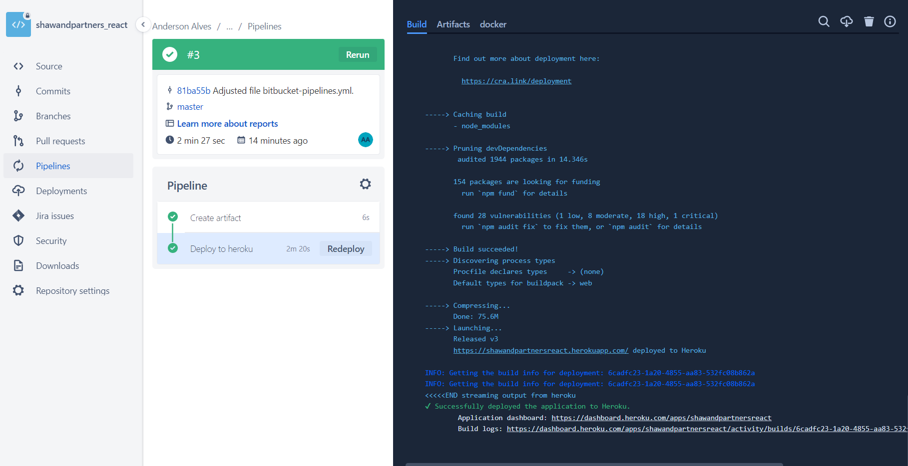

# Documentation

### Requirements

You need to install the NodeJS for run in local environment;

### Local environment

Execute the command `npm start`.

### Production environment

Endpoint: https://shawandpartnersreact.herokuapp.com/

Deploy running using bitbucket-pipelines.

Image:

### Notes

- This is my first ReactJS project, I didn't haved much time for study in this week, but I liked a lot made this;
- I always use jQuery a lot in frontend with Bootstrap, but I wanted to use ReactJS.

*** I work a lot in my actual job. I am a Site Reliability Enginner now and I don't have much time. Thanks.